

# MediBook — Clinic Management System

### *From paper registers and missed calls — to a fully digital clinic in 24 hours.*

---

## 💡 The Problem

> A clinic in London gets 40 calls a day for appointments.
> A clinic in Toronto still uses a paper register for patient records.
> A doctor in Dubai has no idea how many patients are coming tomorrow.

**This is not a developing-world problem. This is a global clinic problem.**

Most clinics — small and mid-sized — have no digital system. They lose patients, miss appointments, and waste hours on admin tasks that software solves in seconds.

**MediBook is that software — and it's built in Flutter.**

---

## ✅ Business Results This App Delivers

| Before MediBook | After MediBook |
|-----------------|----------------|
| Appointments booked by phone — 30% no-shows | Digital booking + push reminder = no-shows eliminated |
| Patient history written in notebooks | Complete digital patient profile — searchable, permanent |
| Doctor has no visibility of daily schedule | Real-time admin dashboard — full day at a glance |
| Staff spend 3 hours/day on manual scheduling | Automated slot management — zero manual work |
| Patients call to ask "is my appointment confirmed?" | Live status updates — Pending → Confirmed → Done |
| No way to reach patients for last-minute changes | One-tap push notification to all or specific patients |
| Clinic data lives on one person's phone | Firebase cloud backend — access from anywhere, never lost |

---

## 📱 Two Complete Apps — One Codebase

MediBook is a **dual-sided system** — a fully featured Doctor/Admin panel AND a complete Patient app, both synced in real-time through Firebase.

---

## 🩺 Admin / Doctor Panel

Everything a clinic needs to run digitally:

- 📊 **Dashboard** — today's appointments count, total patients, pending requests, quick stats — all live
- 📅 **Appointment Manager** — view, confirm, reject, or reschedule any booking in one tap
- 👥 **Patient Directory** — full searchable list of all patients with profile and visit history
- 🕐 **Schedule Builder** — set your available days, time slots, clinic hours and block off dates
- 🔔 **Push Broadcast** — send instant notifications to patients about changes, offers, or reminders
- 📋 **Visit Records** — log patient visit notes and track medical history over time

---

## 👤 Patient App

Everything a patient needs to book and manage care:

- 🔐 **Smart Auth** — register and login via Email or Google Sign-In (Firebase Auth)
- 🏥 **Doctor Discovery** — browse available doctors with specialty, rating, and availability
- 📆 **Appointment Booking** — select doctor → pick date → pick time slot → confirm in 3 taps
- 📌 **My Appointments** — full booking history with live status: Pending / Confirmed / Cancelled
- 🔔 **Real-Time Alerts** — instant push notification when doctor confirms or changes appointment
- 👤 **Patient Profile** — manage personal info, medical notes, and contact details

---

## 🛠️ Tech Stack

| Layer | Technology |
|-------|-----------|
| Framework | Flutter 3.x + Dart 3.x |
| State Management | Riverpod |
| Navigation | GoRouter |
| Authentication | Firebase Auth |
| Database | Firebase Firestore |
| File Storage | Firebase Storage |
| Push Notifications | Firebase Cloud Messaging (FCM) |

---

---

## 📸 Screenshots

### 🩺 Admin Panel

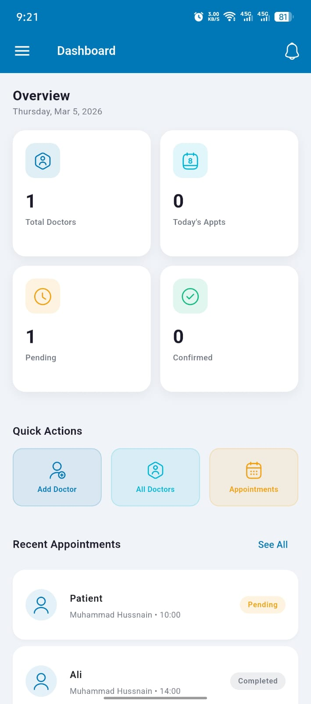
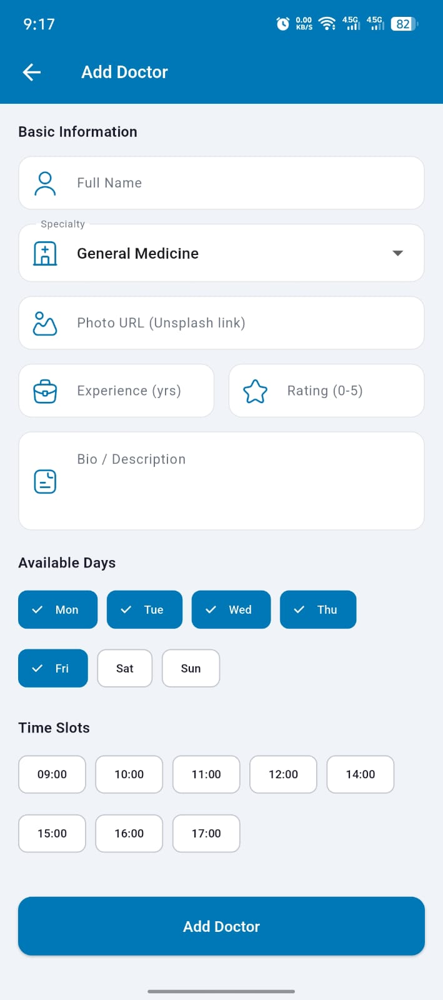
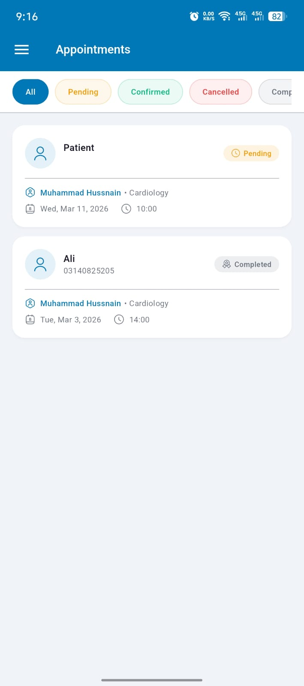
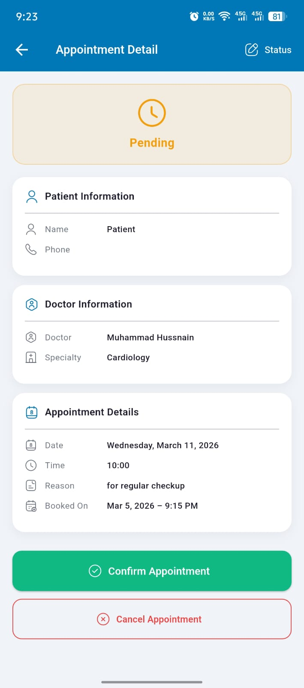
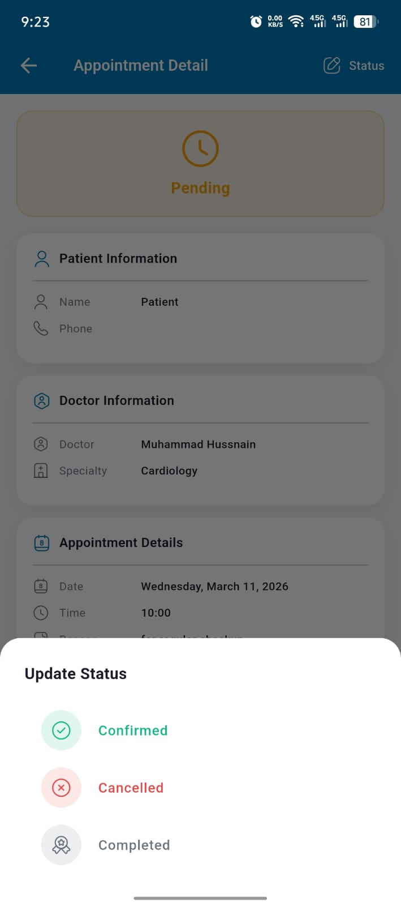

### 👤 Patient App

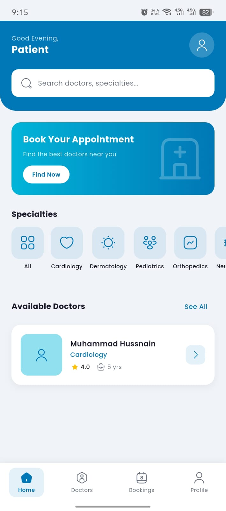
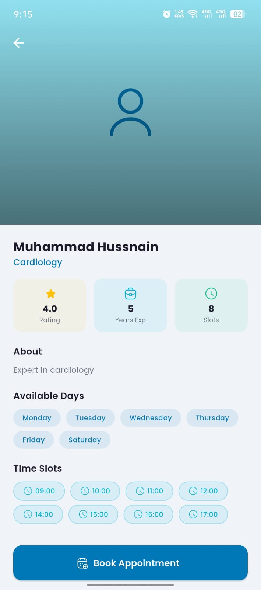
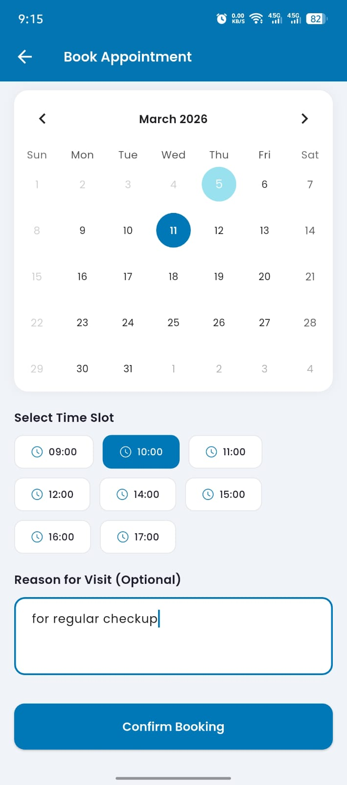
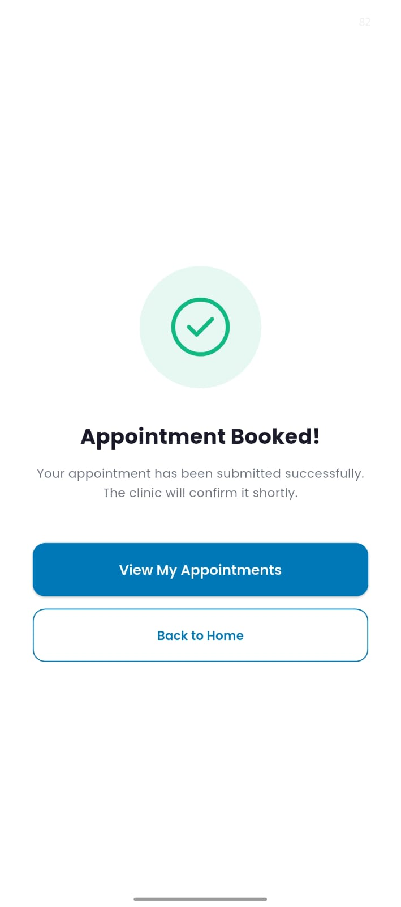
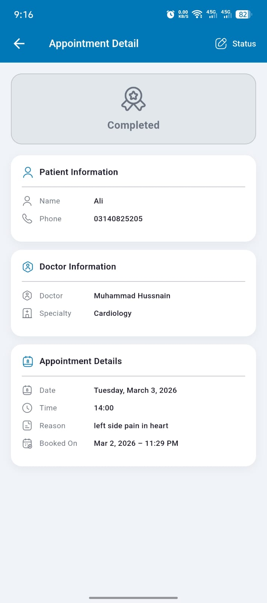
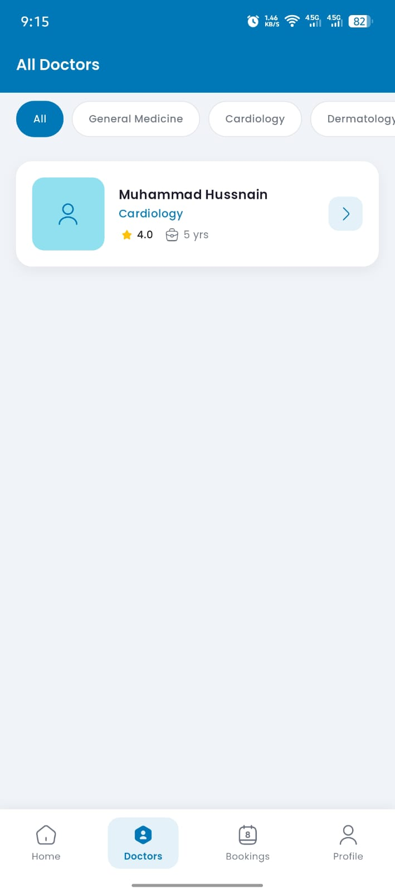

---

---

## 💼  App Built by:

**Muhammad Hussnain** — Flutter Developer, Pakistan
📧 muhammadhussnain0193@gmail.com
🔗 [github.com/MuhammadHussnain07](https://github.com/MuhammadHussnain07)

> I deliver clean, scalable, fully functional Flutter apps — fast.
> Specialized in: Flutter · Firebase · Dual-sided apps · REST APIs · n8n Automation

---

⭐ **Star this repo** if you found it helpful — it helps other developers discover it!

*Built with ❤️ using Flutter & Firebase*

